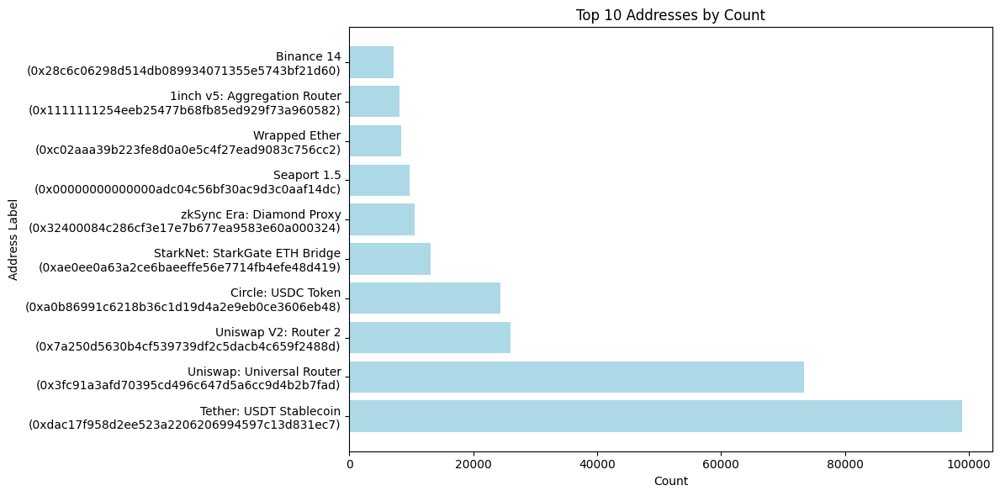

# Analayzing mempool dumpster data

From the [flashbots mempool dumpster](https://mempool-dumpster.flashbots.net/index.html) 2023-09-01.parquet data set

## The 10 most called functions are...

We have sorted the 10 most called function signatures, matched them to their (assumed) function name and graphed it:
- **1**: No function selector ("") called `354,661` times.
- **2**: `transfer(address,uint256)` (0xa9059cbb) called `183,054` times.
- **3**: `approve(address,uint256)` (0x095ea7b3) called `77,012` times.
- **4**: `execute(bytes, bytes[],uint256)` (0x3593564c) called `70,295` times.
- **5**: `deposit(uint256,uint256)` (0xe2bbb158) called `12,284` times.
- **6**: `requestL2Transaction(address,uint256,bytes,uint256,uint256,bytes[],address)` (0xeb672419) called `10,545` times.
- **7**: `setApprovalForAll(address,bool)` (0xa22cb465) called `9,241` times.
- **8**: `depositTransaction(address,uint256,uint64,bool,bytes)` (0xe9e05c42) called `9,034` times.
- **9**: `swapExactETHForTokensSupportingFeeOnTransferTokens(uint256,address[],address,uint256)` (0xb6f9de95) called `8,438` times.
- **10**: `swapExactTokensForETHSupportingFeeOnTransferTokens(uint256,uint256,address[],address,uint256)` (0x791ac947) called `7,726` times.

 

## The 10 most called addresses are...

- **1**: `Tether: USDT Stablecoin` (0xdac17f958d2ee523a2206206994597c13d831ec7) called `98,850` times
- **2**: `Uniswap: Universal Router` (0x3fc91a3afd70395cd496c647d5a6cc9d4b2b7fad) called `73,451` times
- **3**: `Uniswap V2: Router 2` (0x7a250d5630b4cf539739df2c5dacb4c659f2488d) called `26,025` times
- **4**: `Circle: USDC Token` (0xa0b86991c6218b36c1d19d4a2e9eb0ce3606eb48) called `24,357` times
- **5**: `StarkNet: StarkGate ETH Bridge` (0xae0ee0a63a2ce6baeeffe56e7714fb4efe48d419) called `13,148` times
- **6**: `zkSync Era: Diamond Proxy` (0x32400084c286cf3e17e7b677ea9583e60a000324) called `10,545` times
- **7**: `Seaport 1.5` (0x00000000000000adc04c56bf30ac9d3c0aaf14dc) called `9,684` times
- **8**: `Wrapped Ether` (0xc02aaa39b223fe8d0a0e5c4f27ead9083c756cc2) called `8,401` times
- **9**: `1inch v5: Aggregation Router` (0x1111111254eeb25477b68fb85ed929f73a960582) called `8,092` times
- **10**: `Binance 14` (0x28c6c06298d514db089934071355e5743bf21d60) called `7,120` times

#### Sources
- [flashbots mempool dumpster](https://mempool-dumpster.flashbots.net/index.html)
- [paradigm-data-portal](https://github.com/paradigmxyz/paradigm-data-portal/tree/main)
- [data.paradigm.xyz](https://data.paradigm.xyz)
- [etk-4byte](https://github.com/quilt/etk/tree/master/etk-4byte)
- [4byte.directory](https://www.4byte.directory/)
